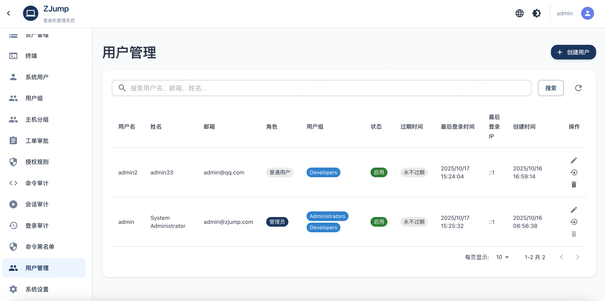
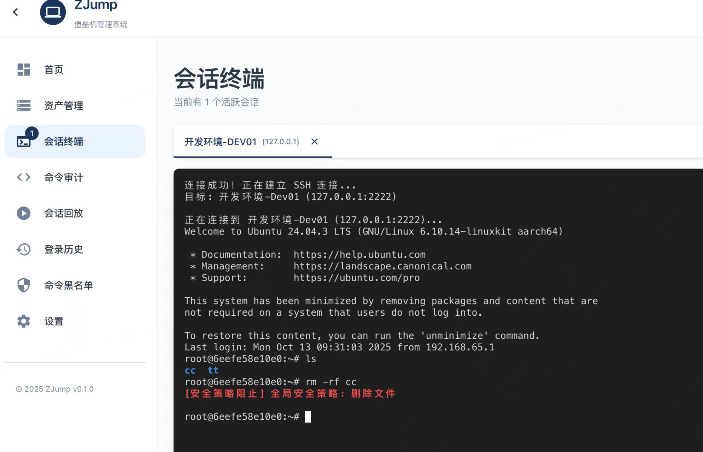

# ZJump - 现代化堡垒机系统

<div align="center">

**基于 Go + React 的企业级堡垒机**

[](https://golang.org)
[](https://www.docker.com)
[](https://reactjs.org)
[](LICENSE)

</div>

---

## 📸 界面预览

### 用户管理
<div align="center">
  
  <p><em>完善的用户管理系统，支持 SSH 密钥认证、用户组管理和账号过期控制</em></p>
</div>

### Web 终端
<div align="center">
  
  <p><em>现代化的 Web 终端，支持实时命令拦截、会话录制和文件传输</em></p>
</div>

---

## 核心特性

- 🔐 **SSH Gateway** - 标准 SSH 协议直连 `ssh user@server -p 2222`
- 🌐 **Web Terminal** - WebSocket 实时终端 + 文件上传下载
- 🚨 **命令拦截** - 实时检测危险命令，飞书/钉钉告警
- 📋 **工单审批** - 飞书/钉钉审批流 + 自动授权
- 👥 **三维权限** - 用户组 + 主机组 + 系统用户
- 🎥 **完整审计** - 会话录制 + 命令历史 + 文件传输
- 🔑 **双因子认证** - 密码 / SSH 密钥
- 🌐 **高可用** - 多实例 + 共享 SSH Host Key
- 📊 **资产同步** - Prometheus
- 🔍 **实时监控** - 主机在线状态、SSH 可用性

## 快速开始

### 前置要求

**开发部署**:
- Go 1.21+
- MySQL 5.7+
- Node.js 16+

**Docker 部署**:
- Docker 20.10+
- Docker Compose (可选)
- MySQL 5.7+

### Docker 一键部署（推荐）

#### 1. 构建镜像

```bash
# 在项目根目录执行
docker build -t zjump:latest .
```

#### 2. 初始化数据库

```bash
# 创建数据库
mysql -h 127.0.0.1 -uroot -p < sql/init.sql
```

#### 3. 准备配置文件

```bash
# 编辑配置文件（数据库连接等）
vim config/config.yaml
```

#### 4. 启动容器

```bash
# 基础启动（前台运行，查看日志）
docker run -it --rm \
  -p 80:80 \
  -p 8080:8080 \
  -p 2222:2222 \
  -v $(pwd)/config:/app/config:ro \
  -v $(pwd)/logs:/app/logs \
  zjump:latest

# 后台运行（推荐生产环境）
docker run -d --name zjump \
  -p 80:80 \
  -p 8080:8080 \
  -p 2222:2222 \
  -v $(pwd)/config:/app/config:ro \
  -v $(pwd)/logs:/app/logs \
  --restart unless-stopped \
  zjump:latest

# 查看日志
docker logs -f zjump

# 停止容器
docker stop zjump

# 删除容器
docker rm zjump
```

#### 5. 使用 Docker Compose（推荐）

创建 `docker-compose.yml`:

```yaml
version: '3.8'

services:
  zjump:
    build: .
    container_name: zjump
    ports:
      - "80:80"      # 前端
      - "8080:8080"  # API
      - "2222:2222"  # SSH Gateway
    volumes:
      - ./config:/app/config:ro  # 配置文件（只读）
      - ./logs:/app/logs          # 日志目录
    environment:
      - ZJUMP_CONFIG=/app/config/config.yaml
      - ZJUMP_ADDR_HTTP=:8080
      - ZJUMP_ADDR_SSH=:2222
    restart: unless-stopped
    healthcheck:
      test: ["CMD", "wget", "-qO-", "http://127.0.0.1/"]
      interval: 30s
      timeout: 5s
      retries: 3
      start_period: 20s
```

启动:

```bash
# 构建并启动
docker-compose up -d

# 查看日志
docker-compose logs -f

# 停止
docker-compose down
```

**访问**: http://localhost (默认账号: `admin` / `admin123`)

### 本地开发部署

```bash
# 1. 初始化数据库
mysql -h 127.0.0.1 -uroot -p < sql/init.sql

# 2. 配置
vim config/config.yaml

# 3. 启动
make build && ./bin/api-server
```

**访问**: http://localhost:8080 (默认账号: `admin` / `admin123`)

## 系统架构

### 单实例

```
┌─────────────────────────────────────────┐
│         ZJump API Server                │
│  ┌─────────────┐  ┌──────────────────┐  │
│  │ HTTP API    │  │  SSH Gateway     │  │
│  │ :8080       │  │  :2222           │  │
│  └─────────────┘  └──────────────────┘  │
└───────────────────┬─────────────────────┘
                    │
            ┌───────▼───────┐
            │  MySQL        │
            └───────────────┘
```

### 高可用

```
            Nginx (负载均衡)
                  │
     ┌────────────┼────────────┐
     │            │            │
Instance-1   Instance-2   Instance-3
:8080/:2222  :8080/:2222  :8080/:2222
     └────────────┴────────────┘
                  │
          ┌───────▼───────┐
          │  MySQL        │
          │ (共享 SSH Key)│
          └───────────────┘
```

## 权限模型

### 三层架构

```
用户组 (UserGroup) ──┐
                    │
主机组 (HostGroup) ──┼──▶ 授权规则 (PermissionRule)
                    │
系统用户 (SystemUser)─┘
```

### 核心概念

**Host（主机资产）**
- 只管理网络信息: IP、端口、设备类型、协议
- 不包含认证信息

**SystemUser（系统用户）**
- 管理认证凭证: username、password、privateKey
- 支持认证方式: `password`（密码）、`key`（SSH密钥）
- 可复用: 一个系统用户授权给多个主机

**PermissionRule（授权规则）**
- 关联: 用户组 + 主机组 + 系统用户
- 支持时间范围和自动过期
- 支持优先级

### 使用示例

```json
// 1. 添加主机（无需认证信息）
{
  "name": "Web Server",
  "ip": "192.168.1.100",
  "port": 22
}

// 2. 创建系统用户（管理认证）
{
  "name": "Root User",
  "username": "root",
  "authType": "password",
  "password": "******"
}

// 3. 配置授权规则
{
  "userGroupId": "dev-team",
  "hostGroupIds": ["test-servers"],
  "systemUserIds": ["root-user"],
  "validFrom": "2025-01-01",
  "validTo": "2025-12-31"
}
```

## 配置

核心配置 `config/config.yaml`:

```yaml
server:
  api_port: 8080
  ssh_port: 2222

database:
  host: 127.0.0.1  # Docker 环境使用容器网络或外部 MySQL 地址
  port: 3306
  user: root
  password: 123456
  dbname: zjump

security:
  jwt_secret: "change-me"
  encrypt_key: "32-characters-key"  # 必须 32 字符
```

### Docker 环境变量

Docker 运行时可使用环境变量覆盖配置:

```bash
docker run -d --name zjump \
  -p 80:80 -p 8080:8080 -p 2222:2222 \
  -e ZJUMP_CONFIG=/app/config/config.yaml \
  -e ZJUMP_ADDR_HTTP=:8080 \
  -e ZJUMP_ADDR_SSH=:2222 \
  -v $(pwd)/config:/app/config:ro \
  -v $(pwd)/logs:/app/logs \
  zjump:latest
```

⚠️ **生产环境务必修改密钥！**

## 开发命令

```bash
# 后端
make build          # 构建
make run            # 运行
make clean          # 清理

# 前端
cd ui/zjump-web
npm install
npm run dev         # 开发模式
npm run build       # 生产构建
```

## 项目结构

```
zjump-backend/
├── cmd/
│   ├── api-server/     # 主服务
│   └── proxy-agent/    # 代理节点
├── internal/
│   ├── api/            # HTTP API
│   ├── sshserver/      # SSH Gateway
│   ├── bastion/        # 堡垒机核心
│   ├── service/        # 业务逻辑
│   ├── repository/     # 数据访问
│   └── model/          # 数据模型
├── ui/zjump-web/       # React 前端
├── sql/                # SQL 脚本
├── config/             # 配置文件
└── docs/               # 文档
```

## 文档

- [DEPLOYMENT.md](docs/DEPLOYMENT.md) - 部署指南
- [ARCHITECTURE.md](docs/ARCHITECTURE.md) - 架构设计
- [API.md](docs/API.md) - API 文档
- [MIGRATION_REMOVE_AUTO_AUTH.md](docs/MIGRATION_REMOVE_AUTO_AUTH.md) - 认证优化迁移

## 常见问题

**数据库连接失败？**
```bash
# 本地
systemctl status mysql
mysql -h 127.0.0.1 -uroot -p

# Docker 环境
docker exec -it zjump sh
# 检查配置文件中的数据库地址是否正确（不能使用 localhost，应使用实际 IP）
```

**Docker 容器无法连接数据库？**
```bash
# 使用 Docker 网络
docker run --network host  # 使用宿主机网络

# 或使用外部 MySQL IP
# 在 config.yaml 中配置数据库地址为宿主机 IP，如 192.168.1.100
```

**SSH 连接失败？**
```bash
# 本地
netstat -tlnp | grep 2222
tail -f logs/zjump.log

# Docker
docker logs zjump | grep ssh
docker exec -it zjump netstat -tlnp | grep 2222
```

**公钥认证失败？**
```bash
ssh -o PreferredAuthentications=publickey \
    -o NumberOfPasswordPrompts=0 \
    user@server -p 2222
```

**Docker 构建失败？**
```bash
# 检查 Go 版本要求
# 项目要求 Go 1.24.0，Dockerfile 会自动下载所需工具链
# 如遇网络问题，可尝试：
docker build -t zjump:latest .
```

**浏览器访问返回 302 重定向？**
```bash
# 问题：前端 API 请求使用了错误的域名
# 解决：已修复，使用相对路径自动适配当前域名
# 需要重新构建 Docker 镜像：
docker build -t zjump:latest .

# 然后重启容器：
docker-compose down && docker-compose up -d
# 或
docker stop zjump && docker rm zjump
docker run -d --name zjump \
  -p 80:80 -p 8080:8080 -p 2222:2222 \
  -v $(pwd)/config:/app/config:ro \
  -v $(pwd)/logs:/app/logs \
  --restart unless-stopped \
  zjump:latest
```

**API 请求失败或 404？**
```bash
# 检查 Nginx 是否正常运行
docker exec -it zjump nginx -t

# 检查后端服务是否运行
docker logs zjump | grep zjump-api

# 检查端口是否暴露
docker ps | grep zjump

# 测试 API 端点
curl http://localhost/api/health
```

## 技术栈

**后端**: Go 1.24+ / Gin / GORM / golang.org/x/crypto/ssh  
**前端**: React 18 / TypeScript / Material-UI / Vite  
**存储**: MySQL 5.7+ / Redis (可选)  
**协议**: SSH (完整支持) / RDP (开发中)  
**容器化**: Docker / Docker Compose / Nginx

## 联系方式

**QQ 交流群**: 675310096

- 使用交流和技术讨论
- 问题反馈和建议
- 获取最新版本更新
- 商业授权咨询

## 许可证

GNU General Public License v3.0 (GPLv3)

个人使用、学习、研究免费。商业使用需授权，请联系 QQ 群。

---

<div align="center">

Made with ❤️ by ZJump Team

</div>
